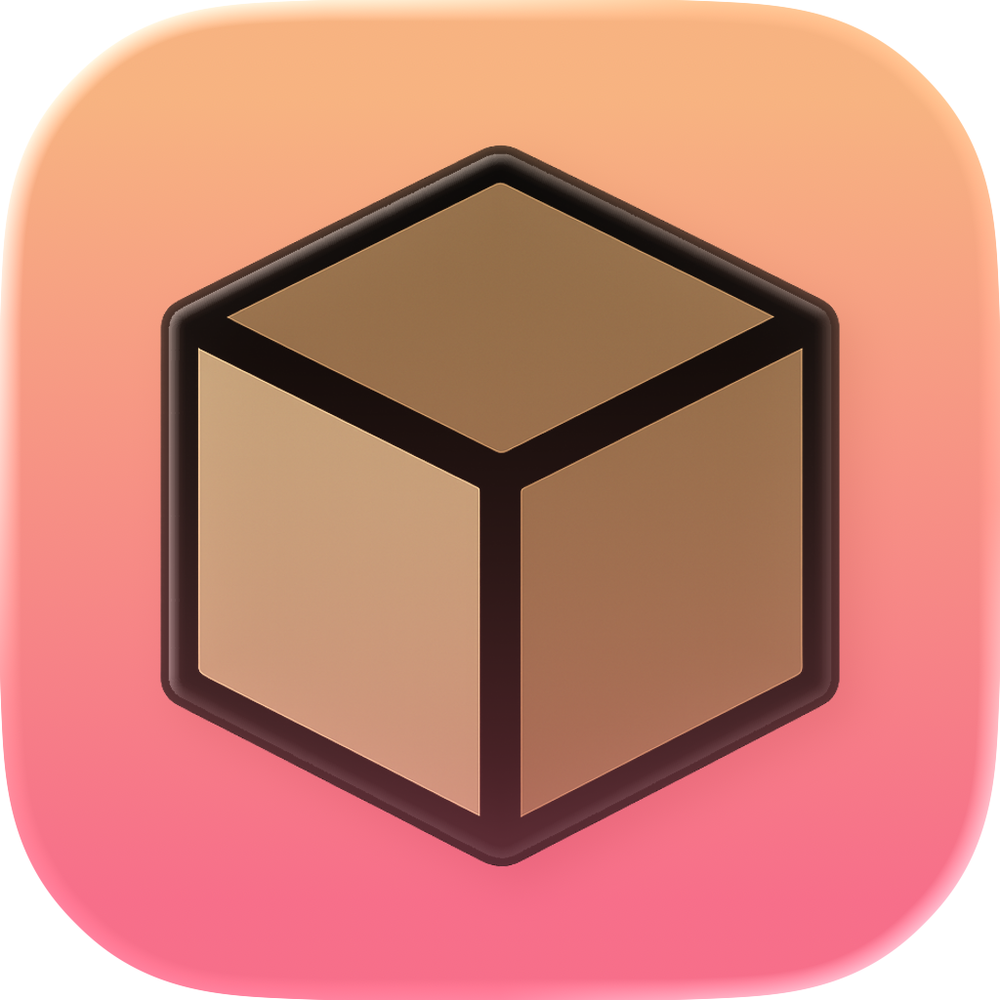

<div align="center">

# Macbooru — нативный Danbooru‑клиент для macOS




Нативное приложение на Swift/SwiftUI для просмотра Danbooru на macOS. Быстрый поиск по тегам, удобная сетка, детальная карточка поста, расширенные подсказки и приятный UX.

<sub>Минимальная поддерживаемая платформа: macOS 15/26 (Sequoia/Tahoe)</sub>

</div>

## Возможности

- Поиск по тегам с рейтингами `rating:*` (G/S/Q/E), минус‑тегами и автодополнением
- Сортировка чипами: Recent, Newest, Oldest, Rank, Score, Favs, Random
- Сохранённые запросы (Saved) с пином/удалением и ограничением по высоте блока (Expand/Collapse)
- История поисков (Recent) — быстрый доступ к последним запросам
- Адаптивная сетка с постраничной подгрузкой и безопасным блюром NSFW (Q/E)
- Детальная карточка: панорамирование/масштабирование, копирование тегов/ссылок, загрузка изображения
- Прогрессивная подмена превью на более детальные версии, устойчивый лоадер картинок
- Настройки macOS: ввод Danbooru API key/username, управление дисковым кешем изображений
- Комментарии с предпросмотром Markdown/BBCode, пагинацией и быстрым обновлением
- Ненавязчивые тосты об ошибках и Retry

## Архитектура

Проект следует принципам Clean Architecture (слои сверху вниз):

- Presentation (SwiftUI): экраны, навигация, стейт (`SearchState`)
- Domain: (зарезервировано) — юзкейсы/интеракторы; логика постепенно выносится из UI
- Data: `DanbooruClient` (HTTP, async/await), репозитории (`PostsRepository`)

Технологии:

- Swift 6.2, SwiftUI, Concurrency (async/await)
- Сеть: `URLSession`, JSONDecoder (устойчивый ISO8601 разбор с/без миллисекунд)
- Изображения: собственный лёгкий загрузчик + `NSCache` + `URLCache` (планируется Nuke/DataCache)
- Логирование: стандартные принты (планируется `os.Logger` + `os_signpost`)
- DI: лёгкий через `Environment` (в процессе)
- Тесты: XCTest (юнит/базовые UI)

Папки:

- `Macbooru/Models` — модели (`Post`, `SearchState`, `SavedSearch`, `RecentSearch`, `Tag`)
- `Macbooru/Networking` — клиент, лоадер изображений, URL-хелперы
- `Macbooru/Repositories` — интерфейсы и реализации репозиториев
- `Macbooru/Views` — SwiftUI‑экраны (Sidebar, Grid, Post detail)
- `MacbooruTests`, `MacbooruUITests` — тесты
- `docs/` — архитектура/roadmap/API coverage (локально игнорируется в .gitignore)

## Сборка и запуск

Вариант 1 — Xcode (рекомендуется):

1. Откройте `Macbooru.xcodeproj`
2. Выберите схему `Macbooru`
3. Product → Run (⌘R)

Вариант 2 — командная строка (если настроен `xcode-select` на Xcode):

```bash
# Список схем
xcodebuild -list -project Macbooru.xcodeproj

# Сборка
xcodebuild -scheme Macbooru -project Macbooru.xcodeproj -destination 'platform=macOS' build

# Тесты
xcodebuild -scheme Macbooru -project Macbooru.xcodeproj -destination 'platform=macOS' test
```

## Тесты

- Юнит‑тесты: `MacbooruTests` (пример: декодирование `Post`, сборка URL)
- UI‑тесты: `MacbooruUITests` (запуск приложения, проверка базовых сценариев)

Запуск в Xcode: Product → Test (⌘U)

## Конфигурация и секреты

- Авторизация Danbooru (username + API key) поддерживается: откройте `Macbooru` → `Settings…` (⌘,) и заполните раздел *Danbooru Credentials*. Данные сохраняются в системном Keychain и автоматически проверяются (отображается текущий пользователь или ошибка).
- Очистка полей и сохранение удаляет значения из Keychain.
- Соблюдайте ToS Danbooru и учитывайте rate limits.

## Безопасность контента (NSFW)

- В настройках сайдбара есть переключатель «Blur NSFW (Q/E)» — включён по умолчанию.
- Для `rating: q` и `rating: e` применяется повышенный блюр и затемнение.
- Иконка `eye.slash` поверх подчёркивает скрытый контент.

## Известные ограничения / TODO

- Нет экрана логина и хранения API ключа в Keychain (планируется Preferences + Keychain)
- Нет избранного/голосований/комментариев/пулов/тегов
- Nuke/DataCache в планах (сейчас — свой лёгкий лоадер + NSCache/URLCache)
- Нет локализаций ru/en (пока строки зашиты в коде)
- Большее покрытие тестами, SwiftLint/SwiftFormat — в планах

## Вклад в проект

Мы рады PR’ам:

- Разбивайте изменения на небольшие PR
- Пишите тесты для публичного поведения
- Соблюдайте стиль Swift 6.x; SwiftLint/SwiftFormat — опционально

Советы по разработке:

- Держите зависимости «сверху вниз»: UI → Domain → Data
- Выносите логику в use cases/репозитории, UI — максимально декларативный
- Для сетевых изменений добавляйте юнит‑тесты формирования запросов и декодеров

## Лицензия

TBD

## Благодарности

- Danbooru за открытый JSON API
- Сообществу SwiftUI за многочисленные примеры и библиотеки (Nuke и др.)
